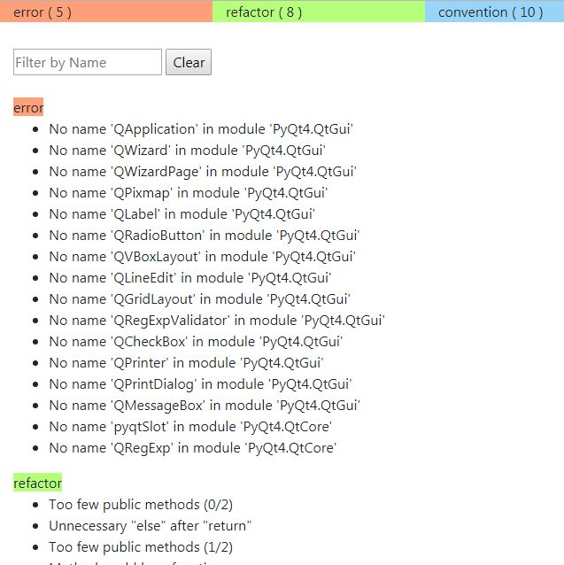

# pylint2html
generate html from pylint json file.

pylint -rn --output-format=json [file.py] > pylint.json

python pylint2html.py  > test.html

Feature:
  Group by type
  Filter by type
  Filter by content

